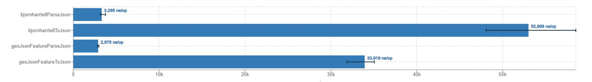

基于jts,提供了一套基础gis对象(Feature Geometry properties)的定义，及其与geojson的互转。
同时定义了一套基于protobuf的二进制压缩规范ProtoFeature，提供了比wkb、geojson更高压缩率的序列化方法。


# 与geojson互转
geojson to FeatureCollection
```java
        String strGeoJson = "{\"features\":[{\"geometry\":{\"coordinates\":[30,10],\"type\":\"Point\"},\"type\":\"Feature\",\"properties\":{\"id\":1}},{\"geometry\":{\"coordinates\":[[30,10],[10,30],[40,40]],\"type\":\"LineString\"},\"type\":\"Feature\",\"properties\":{\"name\":\"hello\"}}],\"type\":\"FeatureCollection\"}";
        GeometryFactory geometryFactory = new GeometryFactory();// jts GeometryFactory
        FeatureCollection featureCollection = GeoJsonFeatureConverter.fromGeoJsonFeatureCollection(strGeoJson, geometryFactory);
        for (Feature feature : featureCollection.getFeatures()) {
            System.out.println(feature.getGeometry());//POINT (30 10)
            System.out.println(feature.getProperties());//{name=hello ...}
        }
```
FeatureCollection to geojson
```java
        GeoJsonObject.FeatureCollection geoJson = GeoJsonFeatureConverter.toGeoJson(featureCollection);
        System.out.println(geoJson.toGeoJsonString());
```
完整的示例请参阅[测试用例](src/test/java/org/wowtools/giscat/vector/pojo/converter/GeoJsonFeatureConverterTest.java)

与 [bjornharrtell](https://github.com/bjornharrtell/jts2geojson) 的geojson的性能比对


| ~ |反序列化 |序列化 |  
|--|--|--|  
|bjornharrtell  |52998.875 ± 14695.850  |3284.615 ±   983.774   |  
|giscat |33918.695 ±  4993.636  |2875.404 ±   242.143   |

[JMH测试代码](src/test/java/org/wowtools/giscat/vector/pojo/converter/GeoJsonFeatureConverterJmhTest.java)


# 与wkb互转
由于geometry对象使用了jts geometry，所以与wkb互转可以直接参考[jts的示例](https://github.com/locationtech/jts/blob/master/modules/core/src/test/java/org/locationtech/jts/io/WKTReadWriteTest.java)

# 与protobuf互转
ProtoFeature是一套基于protobuf的二进制压缩规范，提供了比wkb、geojson更高压缩率的序列化方法。

[ProtoFeature压缩规范](src/main/resources/ProtoFeature.proto)


FeatureCollection to ProtoFeature bytes
```java
        FeatureCollection featureCollection = new FeatureCollection();
        ArrayList<Feature> features = new ArrayList<>(2);
        for (int i = 0; i < 2; i++) {
            Feature feature = new Feature();
            feature.setGeometry(new WKTReader().read("POINT (30 10)"));
            feature.setProperties(Map.of("id",1,"name","tom"));
        }
        featureCollection.setFeatures(features);
        byte[] bytes = ProtoFeatureConverter.featureCollection2Proto(featureCollection);
```
ProtoFeature bytes to FeatureCollection
```java
        byte[] bytes = xxx;
        FeatureCollection featureCollection1 = ProtoFeatureConverter.proto2featureCollection(bytes, SampleData.geometryFactory);
        for (Feature feature : featureCollection1.getFeatures()) {
        System.out.println(feature.getGeometry());//jts geometry
        System.out.println(feature.getProperties());//Map<String, Object>
        }
```
jts Geometry to ProtoFeature bytes
```java
        Geometry geometry = new WKTReader().read("POINT (30 10)");
        byte[] bytes = ProtoFeatureConverter.geometry2Proto(geometry);
```
ProtoFeature bytes to jts Geometry
```java
        byte[] bytes = xxx;
        Geometry geometry = ProtoFeatureConverter.proto2Geometry(bytes, SampleData.geometryFactory);
```
完整的示例请参阅[测试用例](src/test/java/org/wowtools/giscat/vector/pojo/converter/ProtoFeatureConverterTest.java)
